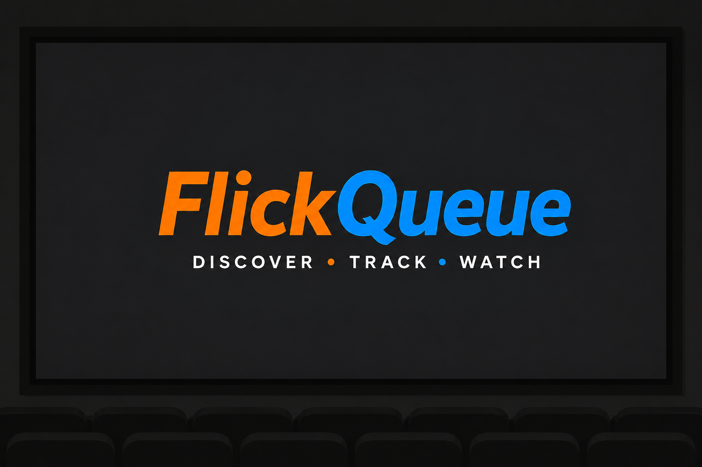
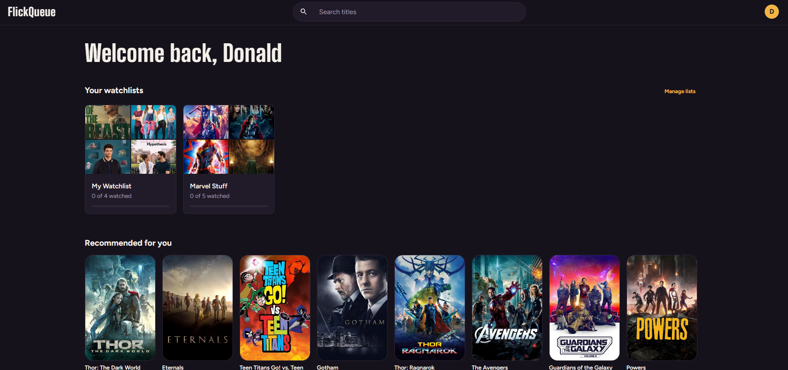
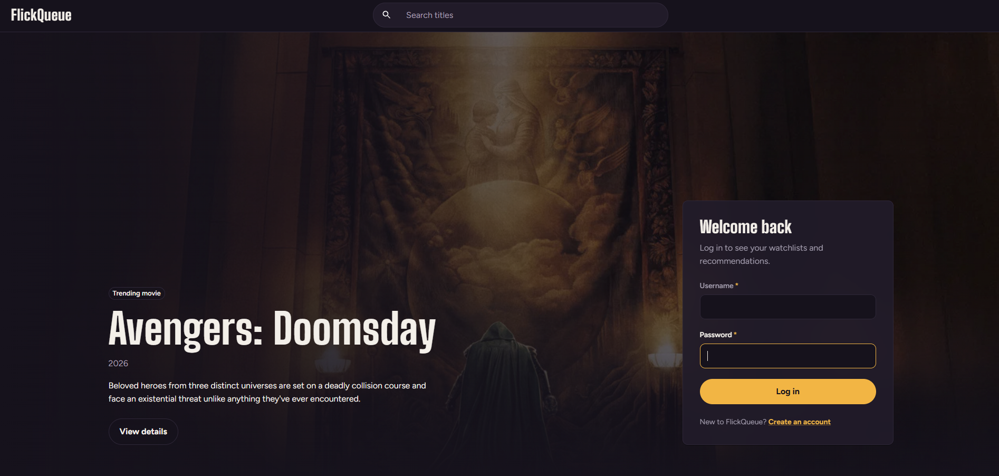
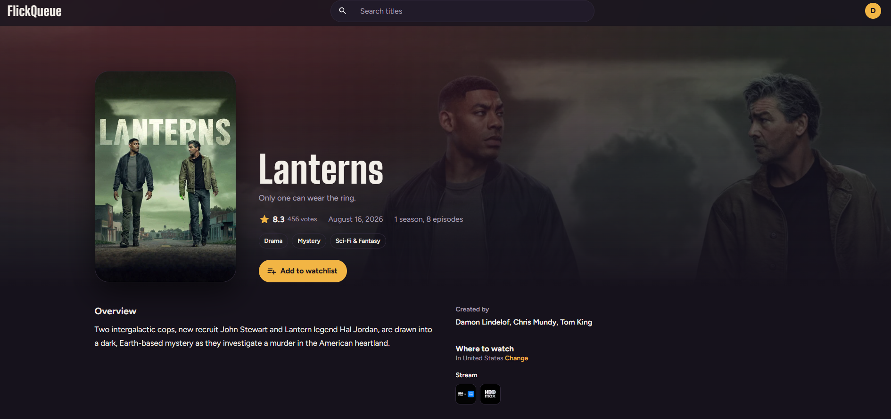
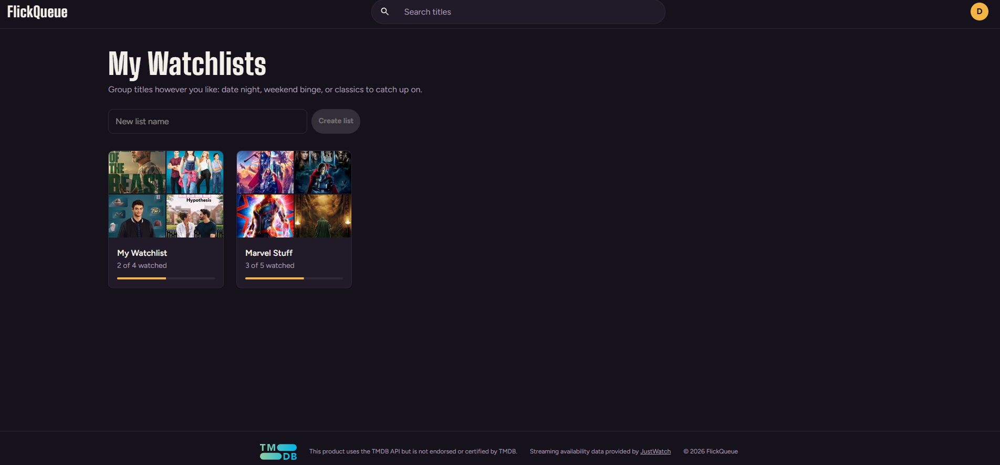
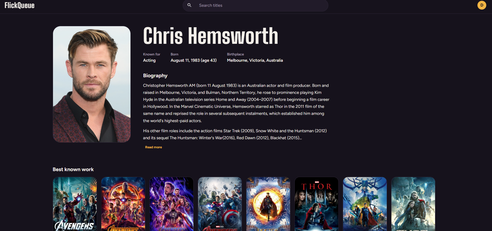

<p align="center">
  
</p>

<p align="center">
  A movie and TV watchlist app built with Next.js, React, Redux Toolkit, MUI, and PostgreSQL.
  <br />
  <a href="https://flickqueue.timberfoottech.com"><strong>Live demo</strong></a>
</p>

## Overview

FlickQueue lets you discover movies and TV shows, save them to your own watchlists, mark what you've watched, and see where each title is streaming in your country. Title, cast, and trending data come from The Movie Database (TMDB), and streaming availability comes from JustWatch through TMDB.



## Features

- **Discover:** a rotating carousel of this week's trending titles on the home page, plus trending movie and TV rows on the dashboard.
- **Search:** search movies and TV shows by title from any page. The search term lives in the URL, so results can be refreshed or shared.
- **Title pages:** overview, rating, genres, runtime or seasons, creators, cast, and recommendations.
- **Where to watch:** streaming, rental, and purchase options for the user's chosen country.
- **Person pages:** biography, best known work, and a full filmography merging cast and crew credits.
- **Watchlists:** create, edit, and delete lists, add titles from any poster, mark items watched, filter by To Watch or Watched, and track progress.
- **Recommendations:** a dashboard row built from the user's most recently saved titles, skipping anything already saved.
- **Accounts:** sign up, log in, edit profile details, change password, choose a streaming country, and delete the account.
- **Adult content control:** off by default. Turning it on requires an 18+ confirmation that the server records and enforces.

| Home | Title |
|---|---|
|  |  |

| Watchlist | Person |
|---|---|
|  |  |

## Tech Stack

| Area | Tools |
|---|---|
| Framework | Next.js 16 (Pages Router), React 19 |
| State | Redux Toolkit, React Redux |
| UI | MUI 9 with Emotion, Big Shoulders Display and Figtree fonts |
| Database | PostgreSQL 16 via `pg` |
| Auth | JWT in an httpOnly cookie (`jsonwebtoken`), passwords hashed with `bcryptjs` |
| Data | TMDB API (v3), JustWatch availability via TMDB, `axios` |
| Tooling | ESLint 9 (flat config) |
| Hosting | Ubuntu VPS, nginx, PM2, Let's Encrypt |

## Architecture Highlights

- **Server-rendered pages.** Title, person, home, and dashboard pages load their data in `getServerSideProps`, so the TMDB API key never reaches the browser and link previews show real content.
- **One wrapper for every API route.** `createHandler` in `src/lib/api.js` handles method checks, authentication, JSON-only request bodies (415 otherwise), same-origin checks on writes (403 otherwise), and consistent error responses. Database unique violations are mapped to friendly messages by constraint name.
- **Validation in two places.** `src/lib/validation.js` holds the rules shared by forms and API routes, and the same limits are enforced again in the database with `CHECK` constraints and case-insensitive unique indexes.
- **Auth.** Logins are case-insensitive and compare against a dummy hash for unknown users to avoid leaking which usernames exist. The session is a signed JWT in an httpOnly, SameSite=Lax cookie. `src/proxy.js` (Next 16's replacement for middleware) redirects signed-out visitors away from private pages, and redirects after login are limited to same-origin paths.
- **Content filtering.** Adult titles are filtered on the server based on the user's setting, not just hidden in the UI.
- **Clean state on logout.** The root reducer clears watchlist and search state on logout, session expiry, and a fresh login, so nothing carries over between users.
- **Hardened deployment.** nginx sets HSTS, a strict Content Security Policy, and other security headers, and rate limits the login and signup routes. The database runs under its own role, and nightly backups are kept for 14 days.
- **Lean images.** Next's image optimizer is turned off on purpose. TMDB's CDN already serves pre-sized images, so the server skips that work.

## Getting Started

### Prerequisites

- Node.js 20.9 or newer
- PostgreSQL 16
- A free TMDB API key (v3) from [themoviedb.org](https://www.themoviedb.org/settings/api)

### Setup

1. Clone the repo and install dependencies:

```bash
   git clone https://github.com/KBiz65/flick_queue.git
   cd flick_queue
   npm install
```

2. Create the database and load the schema:

```bash
   createdb flickqueue
   psql -d flickqueue -f db/schema.sql
```

3. Copy the example environment file and fill it in (see below):

```bash
   cp .env.example .env.local
```

4. Start the dev server and open [http://localhost:3000](http://localhost:3000):

```bash
   npm run dev
```

For a production build, run `npm run build` and then `npm start`.

### Environment Variables

| Variable | Description |
|---|---|
| `DATABASE_URL` | Full Postgres connection string. If set, the individual settings below are ignored. |
| `DATABASE_HOST` | Postgres host, such as `localhost` |
| `DATABASE_PORT` | Postgres port, defaults to `5432` |
| `DATABASE_NAME` | Database name, such as `flickqueue` |
| `DATABASE_USER` | Database user |
| `DATABASE_PASSWORD` | Database password |
| `JWT_SECRET` | Long random string used to sign login tokens |
| `TMDB_API_KEY` | TMDB API key (v3 auth) |

### Database Changes

`db/schema.sql` always reflects the current schema, so a new database only needs that file. Existing databases are updated with the numbered scripts in `db/migrations/`, run in order.

## Project Structure

```text
db/
  schema.sql             Full current schema
  migrations/            Numbered changes for existing databases
docs/screenshots/        README images
public/                  Favicons, logos, preview image, robots.txt
src/
  components/            Navbar, Footer, media rows, dialogs, forms, and page sections
  lib/                   API wrapper, auth, database pool, TMDB client, validation, shared helpers
  pages/                 Pages and API routes (Pages Router)
    api/                 JSON API
  store/                 Redux store and slices (auth, search, watchlists)
  proxy.js               Route protection for private pages
  theme.js               MUI theme
```

## API Routes

All routes accept and return JSON. Routes marked with a lock require a logged-in user.

| Method | Route | Description |
|---|---|---|
| POST | `/api/auth/signup` | Create an account and log in |
| POST | `/api/auth/login` | Log in |
| POST | `/api/auth/logout` | Log out |
| GET | `/api/auth/session` | Current session, if any |
| GET | `/api/tmdb/multiSearch` | Search movies and TV shows (`searchItem`, `page`) |
| GET | `/api/tmdb/regions` | Countries with streaming data |
| GET, PATCH, DELETE 🔒 | `/api/user` | Read or update your profile, password, and settings, or delete the account (requires password) |
| GET, POST 🔒 | `/api/watchlists` | List watchlists or create one |
| GET, PUT, DELETE 🔒 | `/api/watchlists/[id]` | Get, edit (name and description), or delete a watchlist |
| POST 🔒 | `/api/watchlists/[id]/items` | Add a title to a watchlist |
| PATCH, DELETE 🔒 | `/api/watchlists/[id]/items/[itemId]` | Mark watched or remove a title |

## Attribution


This product uses the TMDB API but is not endorsed or certified by TMDB. Movie and TV data and images are provided by [The Movie Database](https://www.themoviedb.org/).

Streaming availability data is provided by [JustWatch](https://www.justwatch.com/) through TMDB.

## Author

Built by Kevin, Timberfoot Tech LLC.